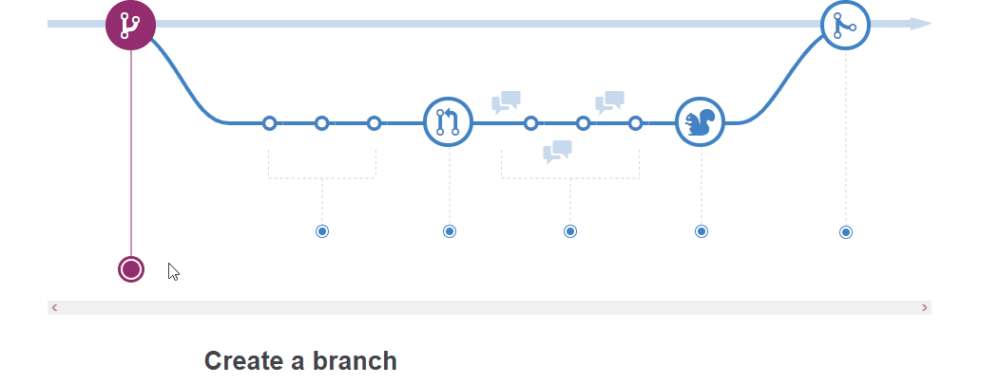

# Gestão de Configuração

## Controle de Versão

A ferramenta de controle de versão adotada no projeto foi o [Git](https://git-scm.com/), sendo que o [Github](https://github.com) foi utilizado para hospedagem do repositório `upstream`.

O projeto segue o workflow GitHub Flow, que é baseado em 6 princípios:

>  1. Tudo na branch `master` é implementavél.
> 
> 2. Para trabalhar em algo novo, crie uma branch apartir da `master` e dê um nome descritivo. (i.e., refatorar-autenticacao, templates-home).
> 
> 3. Faça `commit` para essa branch localmente e dê `push` regularmente do que foi feito para uma branch de mesmo nome no remote.
> 
> 4. Quando precisar de feedback/ajuda, ou pensar que a branch está pronta para o `merge`, abra um `pull request`.
> 
> 5. Depois que alguém revisou e aprovou o `feature`, pode haver o `merge` com a branch `master`.
> 
> 6. Uma vez que feito o `merge` e o push para a `master`, pode e *deve* implementar imediatamente.

Portanto, o projeto segue a seguinte convenção para o nome de branchs:

- `master`: versão pronta para implementação (deploy)
- `nome-explicativo`: versão herdada da `master`.

Quanto à gerência de issues, o projeto adota a seguinte convenção para
etiquetas:

- `bugfix`: uma funcionalidade encontra-se com problemas
- `enhancement`: uma funcionalidade precisa ser melhorada
- `feature`: uma nova funcionalidade precisa ser introduzida

 
## Hospedagem

Para hospedar o projeto, foi utilizado o serviço do Heroku pela facilidade da implementação e acesso.

Inicialmente, a hospedagem tem seu deploy feito `PHP` para utilizar a plataforma. Porém, isso não representa a linguagem final a se utilizar no back-end do projeto.

## Fluxo de Publicação

Seguindo o modelo do GitHub Flow apresentado acima, a branch `master` deve estar sempre pronta para deploy.
Portanto, no momento que os `pull-request`s para a `master` são confirmados e assinados, é feito a publicação manual do projeto, isto é, o comando `push` da `master` para a branch `heroku`, completando assim o processo de 
implementação dos códigos.
